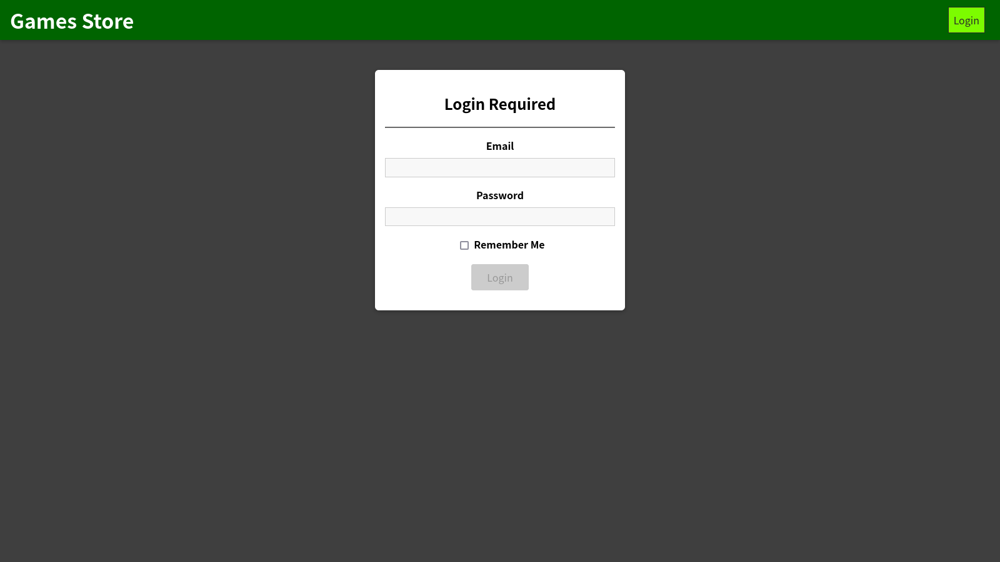
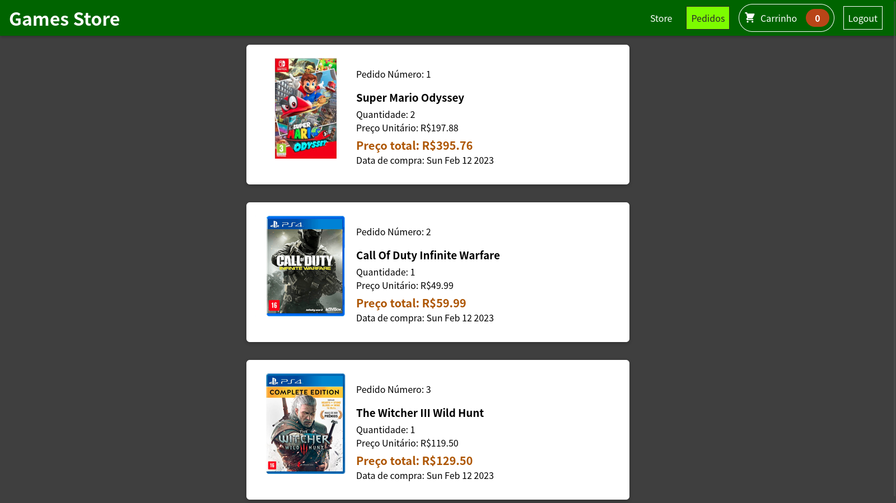
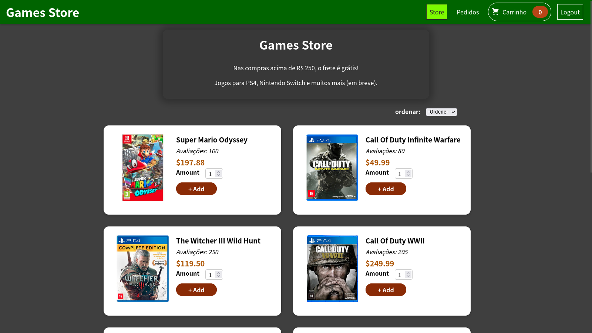
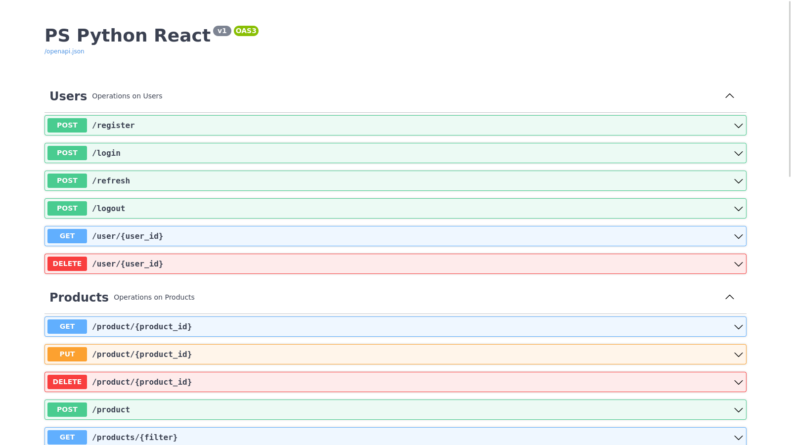

# React + Flask

## Descrição

A ideia consiste em criar uma API HTTP de um pseudo e-commerce de games utilizando Python (preferencialmente com framework flask), e construir a interface do e-commerce utilizando React Web. 

A lista de produtos está disponível no arquivo products.json.

As imagens estão disponíveis no arquivo assets.zip

## Executar a aplicação
Para executar a aplicação, basta possuir o Docker e Docker Compose instalados na máquina.
<pre>docker compose up
</pre>
Ou usar o comando abaixo para versões mais antigas do docker compose
<pre>docker-compose up
</pre>

## Link para Aplicação React
`http://localhost:3000` 
[React-webapp](http://localhost:3000)

## Link para Documentação com Swagger
`http://localhost:5000/swagger-ui` 
[Swagger-docs](http://localhost:5000/swagger-ui)

## Front-end

## Back-end

