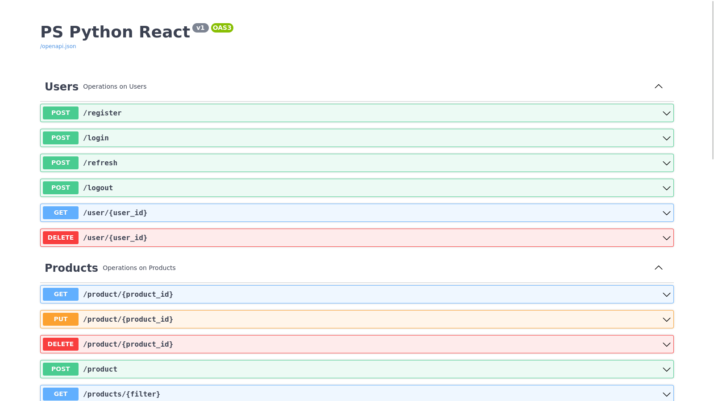

# Rest API

## Requisitos do cliente
Possuir uma máquina com ambiente python configurável e/ou docker, caso queira executar a aplicação em um container.

## Tecnologias usadas
- API Rest
    + [Flask](https://flask.palletsprojects.com/en/2.2.x/)
    + [Flask-Smorest](https://flask-smorest.readthedocs.io/en/latest/)
- Testes
    + [Pytest](https://coverage.readthedocs.io/)
    + [Testes com Pytest](https://flask.palletsprojects.com/en/2.2.x/tutorial/tests/)
- Implantação
    + [Gunicorn](https://gunicorn.org/)
    + [Implantação com Gunicorn](https://flask.palletsprojects.com/en/2.2.x/deploying/gunicorn/)
    + [Docker](https://www.docker.com/products/docker-desktop/)
    + [Docker Compose](https://docs.docker.com/compose/)

## Iniciar a aplicação

### Iniciar a aplicação  usando Docker Compose
No meu setup foi utilizado o Docker Compose versão v2.15.1
<pre>
docker compose up
</pre>

## Link para Documentação com Swagger
`http://localhost:5000/swagger-ui` 
[Swagger-docs](http://localhost:5000/swagger-ui)

## Execução local sem usar Docker
Para execução local, é necessário instalar os pacotes necessários:
<pre>pip install -r requirements.txt
</pre>
Também é preciso configurar o banco de dados, usando o arquivo *connection.py* e informar as configurações do banco Postgres.

### Iniciar o banco de dados
<pre>flask --app pspython db migrate</pre>

### Iniciar a aplicação
`Na pasta raiz (backend)`
<pre>gunicorn --bind 0.0.0.0:5000 'pspython:create_app()'
</pre>
