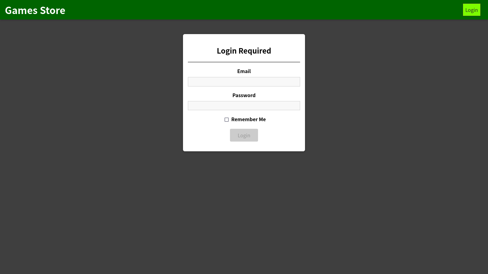
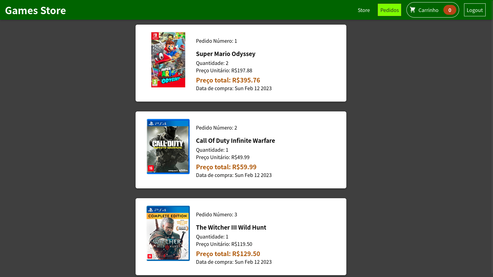
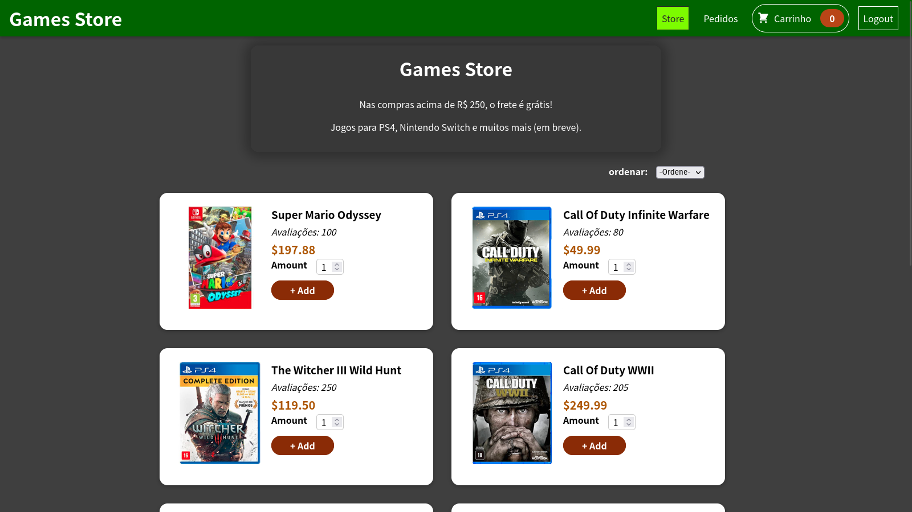

# Desafio Supera Inovação
*Aplicação em React para o desafio*

## Modules
[React](https://pt-br.reactjs.org/)  
[ReactDOM](https://pt-br.reactjs.org/docs/react-dom.html) 
[react-paginate](https://www.npmjs.com/package/react-paginate)  
[react-progressive-graceful-image](https://www.npmjs.com/package/react-progressive-graceful-image)  
[react-router-dom v5](https://reactrouter.com/en/main)  
[react-transition-group](https://reactcommunity.org/react-transition-group/) 

## Rotas utilizadas na aplicação
+ http://localhost:3000/store 
    - Acessar a página principal da aplicação e realizar compras
+ http://localhost:3000/orders 
    - Carrega informações do pedido de um usuário
+ http://localhost:3000/auth
    - Autenticação do usuário:
        + email: *games@email.com*
        + password: *ga23mes#2002*

## Executar apenas o front-end (Avançado)
*O servidor de desenvolvimento precisa do arquivo <b>.env</b> na raiz da pasta.* 
Para criar executar <b>apenas</b> a aplicação do front-end, é preciso criar o arquivo <b>.env</b> e utilizar o [backend](https://github.com/eversonm/desafio-sharenergy-2023-01/tree/everson-magalhaes-cavalcante/back-end) ou uma API com estrutura similar.

### Exemplo de arquivo
<pre><code>REACT_APP_BACKEND_URL=http://localhost:5000
</code></pre>

### Iniciar a aplicação localmente
<pre><code>npm install
npm start</code></pre>

## Para testar a aplicação: 
<b>http://localhost:3000/</b> 
 